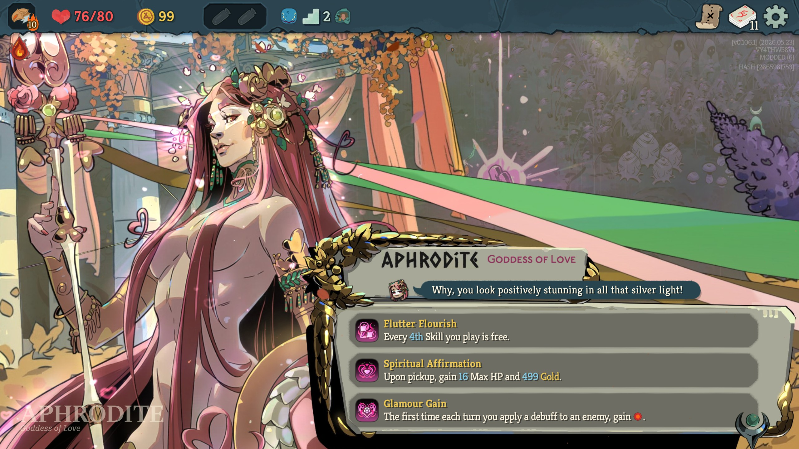
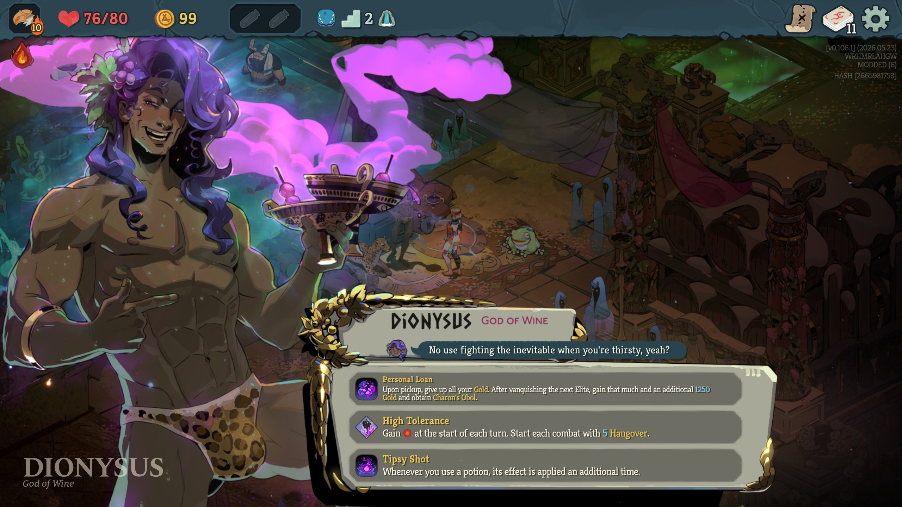
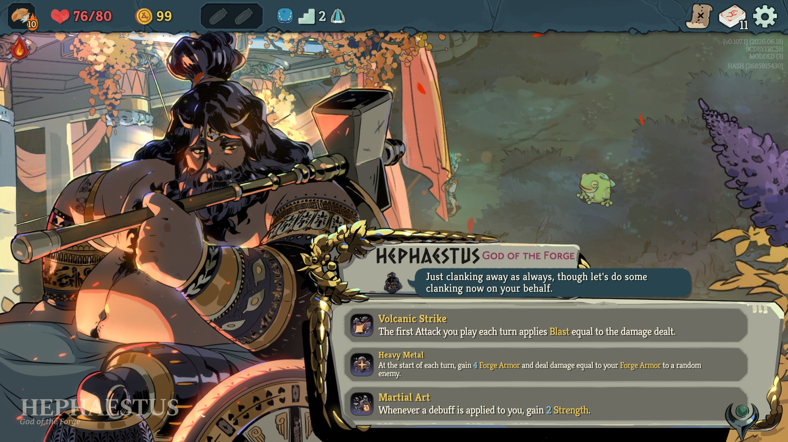
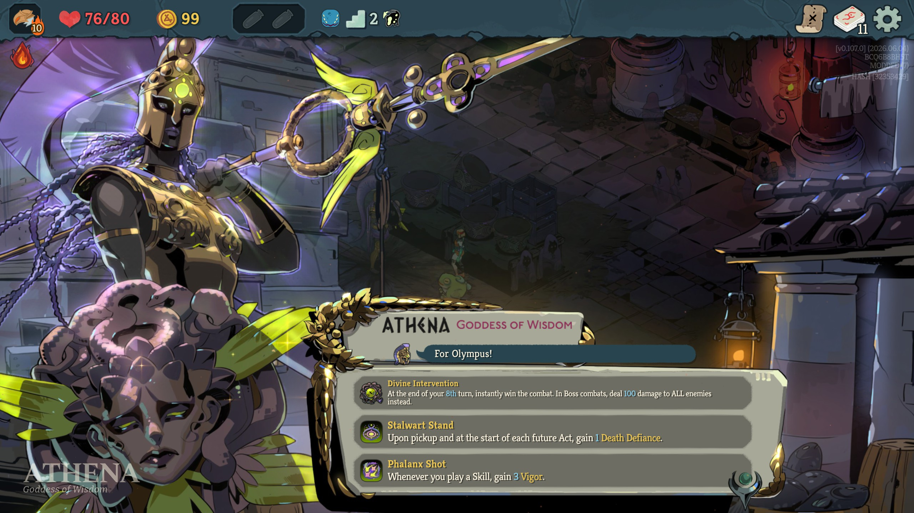
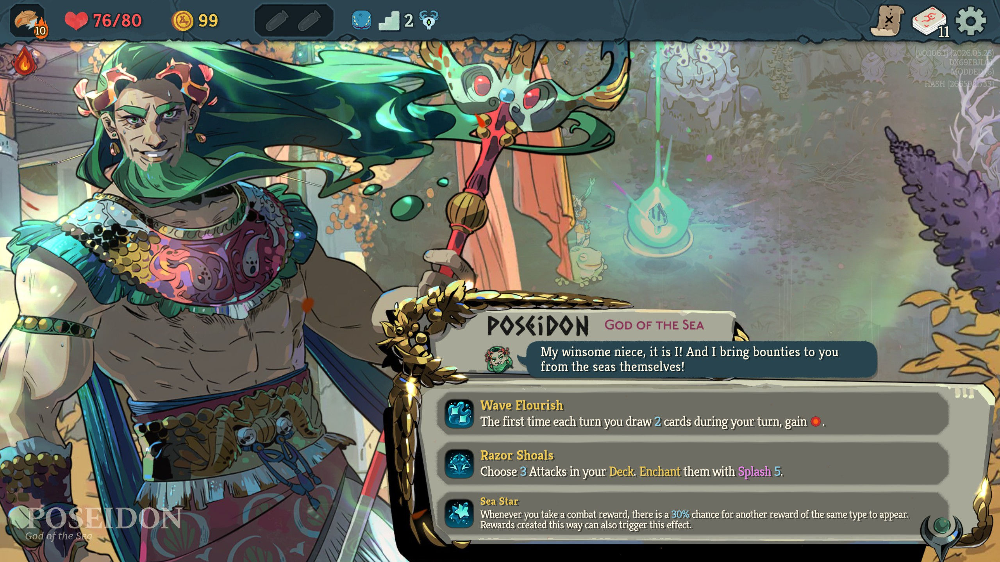
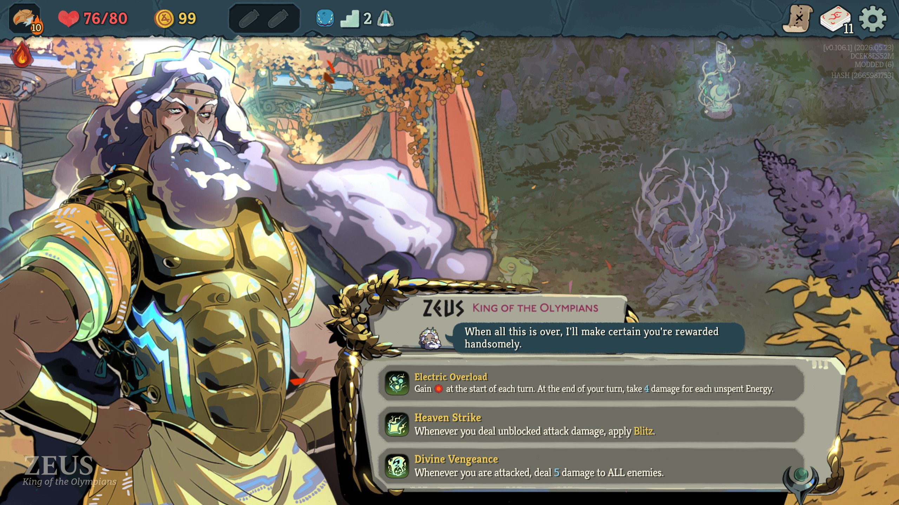
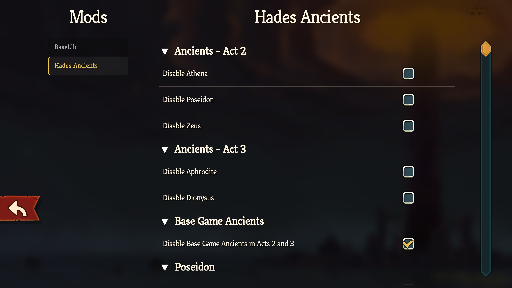

# Hades Ancients

## 📄 Description

This mod introduces a collection of new Ancients from the hit game Hades 2. Currently 5 Ancients are available:

| Act   | Ancient | Specializations                                                                              |
|-------|---|----------------------------------------------------------------------------------------------|
| Act 2 | Athena | Granting different types of Defense, preventing death, and a little bit of Offense.          |
| Act 2 | Poseidon | Awarding playing many Attacks, applying Froth/Rupture, gaining Energy, getting more rewards. |
| Act 2 | Zeus | Blitz, gaining Energy, buffing Attacks, dealing AOE damage.                                  |
| Act 3 | Aphrodite | Weak, Charm, debuffs, healing, dealing more Attack damage.                                   |
| Act 3 | Dionysus | Hangover, potions, max HP, healing, unpredictable combat effects.                            |
| Act 3 | Hephaestus | Applying Blast, Forge Armor, upgrades & enchantments, self-harm.                             |

This mod should work properly in multiplayer. In case of any problems, please report them and include the logs (%APPDATA%\SlayTheSpire2\logs\godot.log file) if possible.

## 🌐 Localization
The mod is available in:
- English
- Korean, thanks to karyulin88

## 📦 Dependencies
- BaseLib version 3.2.0 or newer.

## ⚙️ Installation
1. Go to the [Releases](https://github.com/JohnnyBazooka89/StS2ModHadesAncients/releases) page on GitHub and download the latest version.
2. Extract the ZIP file.
3. Navigate to your *Slay the Spire 2* installation folder: `{SteamLibrary}\steamapps\common\Slay The Spire 2`
4. If the `mods` folder does not exist, create it.
5. Move the `HadesAncients` folder into the `mods` folder.

## 🖼️ Screenshots

## 🤝 Contact
If you run into any issues or have suggestions for balance changes, feel free to reach out on the official Slay the Spire 2 Discord (nickname: JohnnyBazooka89).
